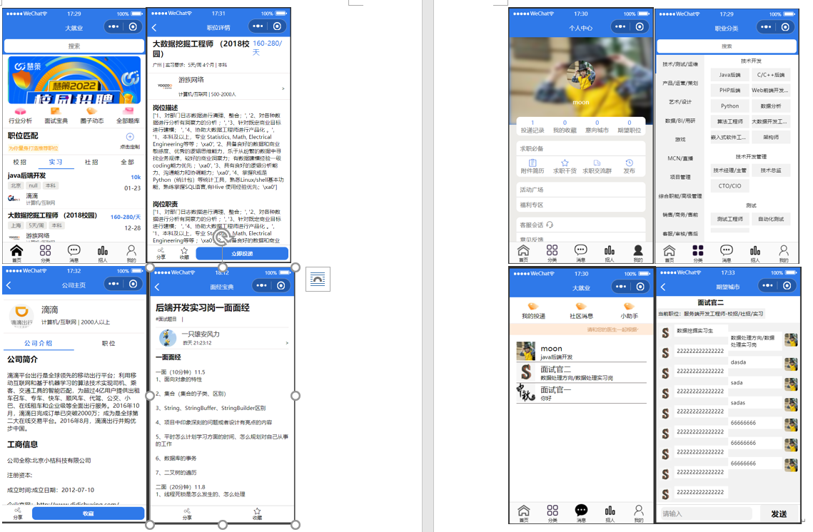

# dajiuye-cloud

#### 介绍
该小程序集求职和招聘为一体，主要功能包括招聘信息的推荐与分类，即时通讯，职位搜索，面经题库展示，简历上传和下载，职位的发布与审核，就业课程秒杀

### 部分页面截图

### 技术选项

#### 前端技术

原生微信小程序开发

#### 后端技术

SpringCloud+SpringBoot+MySQL+Redis+RabbitMQ+WebSockket+SpringSecurity+JWT 

1、使用Token机制+Redis（Lua）解决了接口幂等性问题，使用SpringSecurity控制资源访问权限 

2、基于WebSocket和Stomp协议搭建起聊天室，并基于RabbitMQ对聊天消息异步持久化 

3、使用Redisson分布式信号量解决商品超卖问题，使用RabbitMQ异步下单并完成可靠消息设计 

4、基于Redis缓存热点职位，并使用分布式锁Redisson解决缓存击穿问题，并搭建Redis-Cluster集群提高扩展性和可用性

### 下载安装
weChat_daJiuYe2为小程序代码，其他为后端代码

可加微信号`moon5672369`免费咨询
